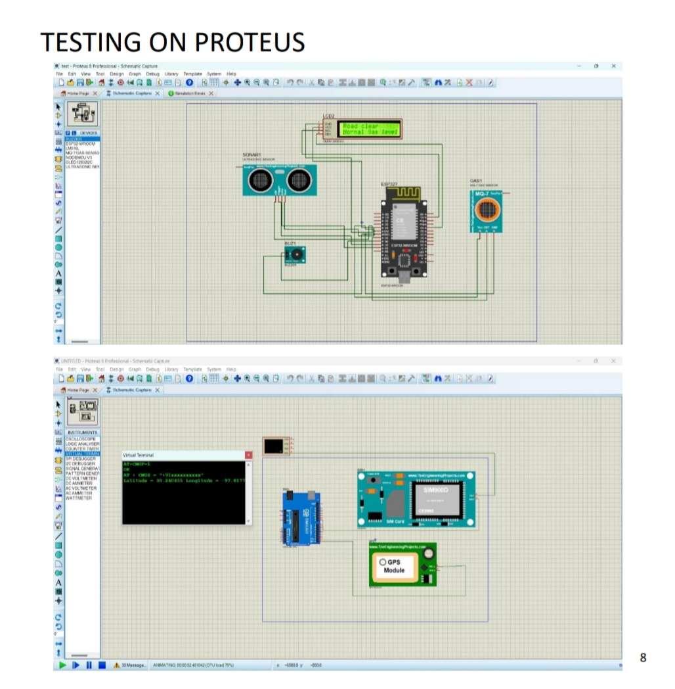

# 🚨 Accident Alert System using GSM, GPS, and Accelerometer

A smart vehicle accident detection and alerting system that uses real-time location tracking via GPS, accident detection using an accelerometer, and alert messaging through GSM. Designed especially for *foggy or mountainous areas* where accidents are common and emergency response is delayed.

---

## 📷 Project Images

### 🔌 Breadboard Setup

### 💻 Proteus Simulation

> Note: Replace the above image paths with actual GitHub image URLs or relative links after uploading.

---

## 🧠 Abstract

This system detects road accidents in real time using an *accelerometer* and immediately sends an alert message via *GSM, including live **GPS coordinates* and a direct *Google Maps link*. It enhances emergency response, prevents accidents through proximity sensing, and detects gas leaks to avoid hazardous situations.

---

## 🎯 Objectives

- Detect accidents using ADXL335 (accelerometer)  
- Send GPS coordinates via GSM  
- Monitor gas levels for leakage detection  
- Alert for nearby obstacles using ultrasonic sensors  
- Ensure faster emergency response in critical areas  

---

## 🛠 Hardware Used

- Arduino Uno  
- ESP32  
- GSM Module (SIM800L)  
- GPS Module (L89 GNSS)  
- Accelerometer (ADXL335)  
- MQ-7 Gas Sensor  
- Ultrasonic Sensor (HC-SR04)  
- 16x2 LCD with I2C  
- 3.7V Battery  
- Breadboard, wires, antennas, toolkit  

---

## 🖥 Software Used

- Arduino IDE  
- Proteus 8.15 (for simulation)  

---

## 🧪 How It Works

1. Accelerometer detects impact.  
2. GPS fetches current coordinates.  
3. GSM sends alert SMS with location.  
4. Sensors monitor gas leaks & proximity.  
5. Location opens directly in Google Maps.  

---

## ✅ Advantages

- Instant accident alert with location  
- Detects gas leakage and obstacles  
- Cost-effective with commonly available modules  
- Can be installed on most vehicles  

---

## ⚠ Limitations

- GSM coverage required  
- Battery drain due to sensor activity  
- Occasional false triggers from sensors  
- Arduino Uno’s processing limits scalability  

---

## 🌍 Applications

- Rideshare safety (Uber, Ola, etc.)  
- Emergency vehicle tracking  
- School and public transport  
- Industrial and mining transport  
- Commercial trucking fleets  

---

## 📌 Conclusion

This system significantly enhances road safety and emergency responsiveness, especially in risky environments like foggy hills or remote highways. With further development, it could be a key component in smart vehicle ecosystems.

---
